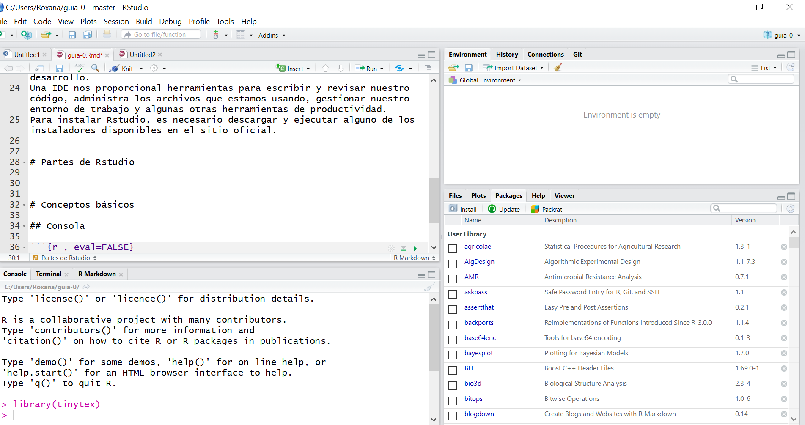
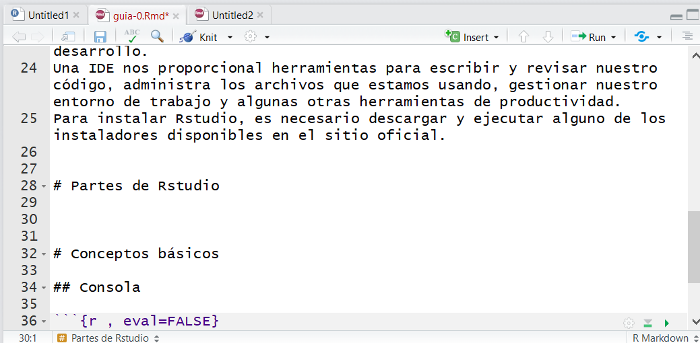
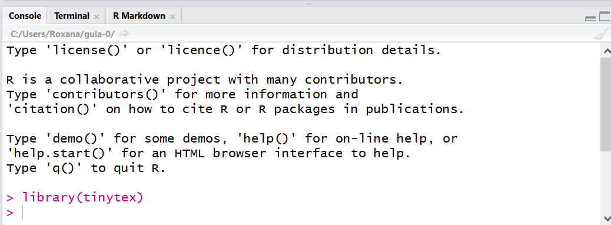
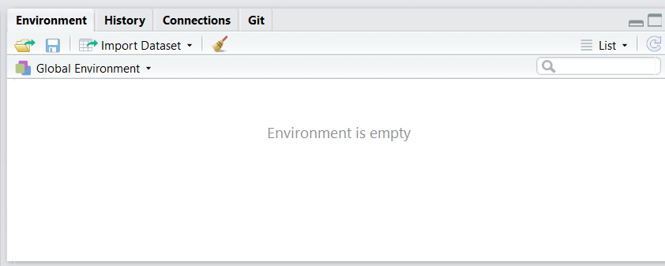
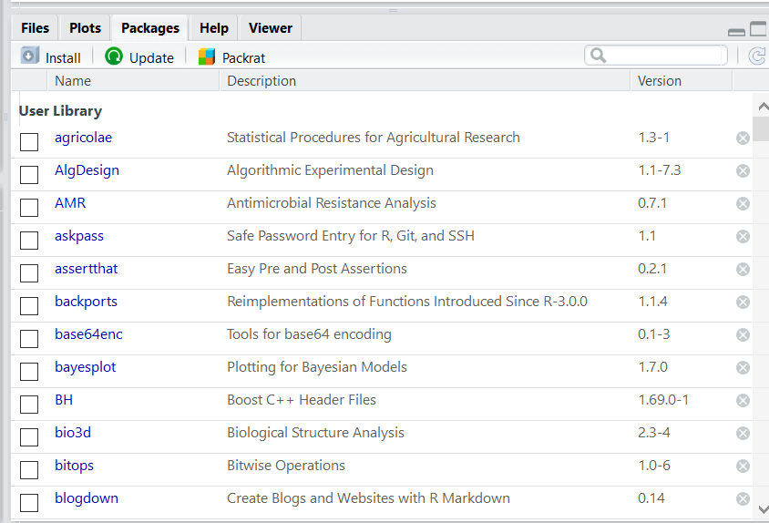

# R y Rstudio

## R

R es un lenguaje de programación y entorno computacional dedicado a la estadística. 
Es un lenguaje de programación porque nos permite dar instrucciones, usando código, a nuestros equipos de cómputo para que se realicen tareas específicas. Cuando instalamos R en nuestra computadora, estamos instalando un entorno computacional. 
R es diferente a otros lenguajes de programación que por lo general están diseñados para realizar muchas tareas diferentes, R fue creado con el único propósito de hacer estadística. 
Para instalar R lo podemos hacer desde el CRAN:

https://cran.r-project.org/bin/windows/base/

También se encuentran las versiones disponibles para Linux y Mac. 

CRAN es el acrónimo para _Cromprehensive R Archive Network_ y es un repositorio oficial de paquetes. 

## Rstudio

Rstudio es una IDE para R. Una IDE es un entorno integrado de desarrollo. 
Una IDE nos proporcional herramientas para escribir y revisar nuestro código, administra los archivos que estamos usando, gestionar nuestro entorno de trabajo y algunas otras herramientas de productividad. 
Para instalar Rstudio, es necesario descargar y ejecutar alguno de los instaladores disponibles en el sitio oficial. 


### Partes de Rstudio

Al abrir Rstudio se visualiza lo siguiente

```{r echo=FALSE}
library(knitr)
 
```

#### Fuente
* Es en donde se escribe el código para documentarlo en scripts. 
* En primer lugar se detallan las librerías con las que se trabajan. 
* Para comentar el código usamos numeral #

```{r, eval=FALSE}
# Este es un comentario
```

```{r echo=FALSE}
library(knitr)
 
```


#### Consola

* Es la parte más importante porque es donde nuestro código es interpretado. 
* Podemos escribir directamente aquí nuestro código y será ejecutado. 

```{r echo=FALSE}
library(knitr)
 
```


#### Entorno, Historia, Conexiones y Git
* En esta parte se guardan las bases de datos, las funciones del entorno de trabajo. 
* También desde allí podemos importar bases de datos. 
* Para limpiar nuestro entorno de trabajo podemos hacerlo con el símbolo de la escobita. 

```{r echo=FALSE}
library(knitr)
 
```

#### Archivos, Gráficos, Paquetes, Ayuda, Visor
* En esta sección podemos ver los archivos la carpeta que funciona como entorno de trabajo. 
* Se pueden visualizar los gráficos que hemos realizado. 
- Se ofrece una lista de paquetes instalados y cargados en nuestro entorno de Rstudio. 
* La ayuda nos permite ver la documentación de una determinada librería. 
* Finalmente en la pestaña _Viewer_ podemos visualizar documentos de texto o interactivos que realicemos. 

```{r echo=FALSE}
library(knitr)
 
```

## Conceptos básicos en el uso de R

En R, todo es un objeto. Todos los datos y estructuras de datos son objetos. Además, todos los objetos tienen un nombre para identificarlos.

### Asignación 
En R usamos <- para asignar un nombre a un objeto

```{r}
radio <- 2
```

### Entorno de trabajo
- Es en donde se guardarán nuestros archivos, scripts y gráficos 

```{r}
getwd()
```

- Si quisiéramos definir otro entorno de trabajo

```{r, eval=FALSE}
setwd()
```

### Paquetes

- Un paquete es una colección de funciones diseñadas para atender una tarea específica. Para instalarlos desde el CRAN lo hacemos de la siguiente manera:

```{r, eval=FALSE}
install.packages("ggplot2")
```

- Una vez concluida la instalación podemos usar las funciones de ese paquete mediante

```{r, eval=FALSE}
library("ggplot2")
```

- Para conocer todos los paquetes que tenemos instalados

```{r, eval=FALSE}
installed.packages()
```

### Scripts
Los scripts son documentos de texto con la extensión .R
Son útiles para guardar y poder compartir código. 


## Tipos de datos 

_En R, todo son objetos_

Los objetos más simples se llaman atómicos:

* character(cadena de caracteres)
* numeric (números reales)
* integer(números enteros)
* complex (números complejos)
* logical (lógicos o booleanos, toman valores de TRUE o FALSE)

## Estructura de datos

### Vectores
Los vectores son arreglos ordenados en los cuales se puede almacenar información de tipo numérico (variable cuantitativa), alfanumérico (variable cualitativa) o lógico (TRUE o FALSE). 
La función de R para crear un vector es __c()__ y que significa concatenar; dentro de los paréntesis de esta función se ubica la información a almacenar. Una vez construído el vector se acostumbra a etiquetarlo con un nombre corto y representativo de la información que almacena, la asignación se hace por medio del operador <- entre el nombre y el vector.

* Vector de enteros
```{r }
c(3,2,5)
```

```{r }
numeros<-c(3,2,5)
numeros
```

* Vector de decimales
```{r }
c(3.2,2.4,5.8)
```

* Vector de caracteres
```{r }
c("Ana","Sofía","Pedro","Juan")
```

* Vector de booleanos
```{r }
c(TRUE, FALSE, TRUE, FALSE)
```


```{r}
knitr::include_url("https://www.youtube.com/watch?v=CCxVQeVijYo&list=PLNwm0SNfmJPjdkSehOLHPjr3ID2161Er8&index=1")
```
### Matrices

Las matrices son arreglos rectangulares de filas y columnas con información numérica, alfanumérica o lógica. Para construir una matriz se usa la función __matrix( )__. Por ejemplo, para crear una matriz de 4 filas y 5 columnas (de dimensión 4×5) con los primeros 20 números positivos se escribe el código siguiente en la consola.

```{r }
mimatriz <- matrix(data=1:20, nrow=4, ncol=5)
mimatriz
```


### Dataframes o Marco de datos

Data.frame es uno de los objetos más utilizados en R, porque permite agrupar vectores con información de diferente tipo (numérica, alfanumérica o lógica) en un mismo objeto, la única restricción es que los vectores deben tener la misma longitud. Para crear un marco de datos se usa la función __data.frame()__

- Paso 1: creamos los vectores
```{r }
#Creamos en primer lugar tres vectores
alumnos<-c("Ana","Sofía","Luis", "Pedro","Juan")
edad<-c(15, 19, 13, 18, 20)
deporte<-c(TRUE, TRUE, FALSE, FALSE, TRUE)
comic.fav<-c('Superman', 'Superman', 'Batman', 'Spiderman', 'Batman')
```

- Paso 2: creamos un data.frame a partir de los vectores
```{r }
#Usamos la función data.frame
mimarco <- data.frame(alumnos, edad, deporte, comic.fav)
mimarco
```


## R como calculadora

### Suma

```{r}
2 + 2 #apretamos enter después
```


### Multiplicación

```{r}
2*5
```

### División real de dos números

```{r}
 5/2
```


### División entera 
Devuelve como resultado la parte entera

```{r}
5%/%2
```

### Potenciación

```{r}
5^2
```

### Potenciación de exponente real

```{r}
5^2.3
```

### Raíz cuadrada de 2

```{r}
sqrt(2)
```

### Logarimto neperiano de 4

```{r}
log(4)
```


### Logaritmo de 4 en base 10

```{r}
log(4,10)
```

### El número e

```{r}
exp(1)
```


## Bibliografía

- R para principiantes _Juan Bosco Mendoza Vega_
Disponible en http://bit.ly/2Zg0I3M
- El arte de programar en R _Julio Sergio Santana & Efraín Mateos Farfán_ Disponible en http://bit.ly/2N2Y1Y8 
- R como calculadora http://ocw.uc3m.es/estadistica/aprendizaje-del-software-estadistico-r-un-entorno-para-simulacion-y-computacion-estadistica/r-como-calculadora 
- Foundations of Statistics with R (2020) _Darrin Speegle and Bryan Clair_  https://mathstat.slu.edu/~speegle/_book/preface.html 