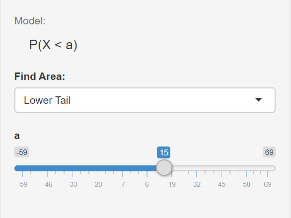
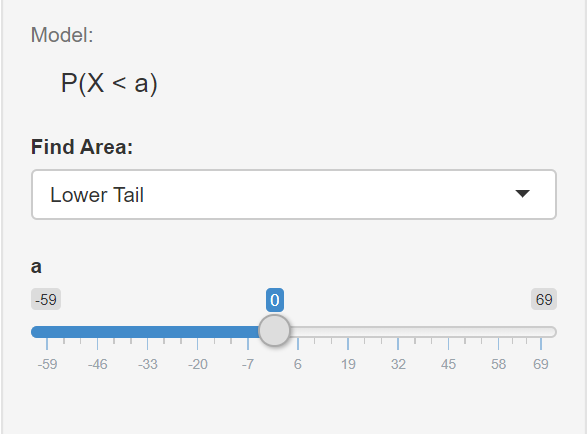
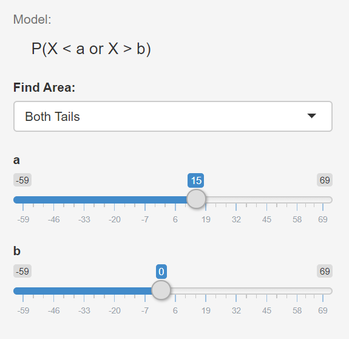
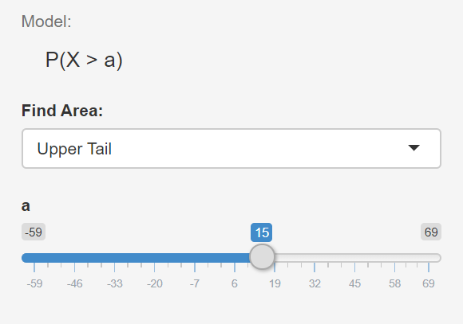

# Guía 4 - Probabilidades. Distribuciones de probabilidad. 

## Objetivos

Que el alumno 

* Calcule probabilidades.

* Reconozca las gráficas de las funciones de distribución y comprendan los cambios que producen los parámetros

* Obtengan probabilidades acumuladas menores o mayores a un valor y entre 2 valores.

* Adquiera competencias en la aplicación de probabilidades a ejemplos reales.


## Ejercicio 1

Calcular las probabilidades de obtener:

* Un número impar en una sola tirada de un dado. 
* La presentación, como mínimo, de una "cara" en dos tiradas de una moneda. 
* La presentación de un as, un diez de diamante o el dos de pick en una sola extracción de u na carta de un mazo de 52. 
* La obtención de 7 puntos en una tirada de un par de dados. 


## Ejercicio 2

Una máquina produce piezas de tipo A y de tipo B. La probabilidad que una pieza A sea defectuosa es de 0.04 y la probabilidad que una pieza B lo sea es de 0.035.
Calcular:
* La probabilidad que las dos piezas sean defectuosas. 
* La probabilidad que ninguna de las dos piezas sea defectuosa.  
* La probabilidad que sea defectuosa la pieza A y no la B.
* La probabilidad que al menos una de las dos sea defectuosa. 


## Ejercicio 3

En un estudio se determinó que la probabilidad de que se produzca un artículo defectuoso en una determinada fábrica es del 0.15. 
Si se toman 5 artículos de ese lote al azar, y se prueban  los mismos. ¿Cuál es la probabilidad?:

* de que 3 o menos de 3 sean defectuosos.
* de que menos de 3 sean defectuosos
* de que más de 2 sean defectuosos
* realizar los cálculos manualmente y verificar los resultados hallados con R.
* Grafique la distribución binomial correspondiente en R. En este caso, el valor de p=0.15. ¿El sesgo es positivo o negativo? Fundamente. 


### En R
Probabilidad de que 3 sean defectuosos == P(x=2)
```{r eval=FALSE}
#Para calcular una probabilidad puntual con distribución binomial
dbinom(x=3, size=5, prob=0.15)
```

Probabilidad de que 3 o menos de 3 sean defectuosos == P(X<=3)
```{r eval=FALSE}
pbinom(q=2, size=5, prob=0.15, lower.tail=TRUE)
```
Probabilidad de que más de 2 sean defectuosos == P(X>2)
```{r eval=FALSE}
pbinom(q=2, size=5, prob=0.15, lower.tail=FALSE)
```

Mediante las siguientes líneas de código va a poder graficar una distribución binomial. Fundamente si el sesgo es positivo o negativo. 
```{r eval=FALSE}
x <- -1:4
prob <- dbinom(x,5,0.15)
barplot(prob,col = "blue",ylim = c(0, 0.6),names.arg=x,
        main="Binomial Distribution\n(n=5,p=0.15)")
```


## Ejercicio 4

En una localidad, en el mes de Julio se producen 2 heladas semanales (en promedio)
* ¿Cuál es la probabilidad de que en 3 semanas se produzcan sólo 2 heladas?
*  Realizar los cálculos manualmente y verificar los resultados hallados con R. 


### En R
¿Cuál es la probabilidad de que en 3 semanas se produzcan 2 heladas? 
```{r eval=FALSE}
dpois(x=2, lambda=6)
```


## Ejercicio 5

Graficar las siguientes funciones de densidad discretas y continuas. 
Interpretar las diferencias observadas al cambiar los parámetros y escribir al menos 2 características de las curvas de las distribuciones que se graficaron. 


* N(0,1); N(0,2); N(3,1)
* T(5); T(100)

### En R

Para graficar funciones de densidad utilizamos la función __curve()__
```{r eval=FALSE}
par(mfrow=c(2,2)) #permite disponer gráficos de a grupos 
curve(dnorm(x, mean = 0, sd = 1), #distribución de probabilidad normal
      from = -4, #límite inferior del eje x
      to = 4, #límite superior del eje x
      type = "l", #tipo de linea trazada
      xlab = "", #sin rótulo el eje X
      ylab = "Probability Density", #rótulo eje Y
      main = "Normal Distribution") #título del gráfico
curve(dnorm(x, mean = 0, sd = 2), #distribución de probabilidad normal
      from = -6, #límite inferior del eje x
      to = 6, #límite superior del eje x
      type = "l", #tipo de linea trazada
      xlab = "", #sin rótulo el eje X
      ylab = "Probability Density", #rótulo eje Y
      main = "Normal Distribution") #título del gráfico
curve(dnorm(x, mean = 3, sd = 1), #distribución de probabilidad normal
      from = -1, #límite inferior del eje x
      to = 7, #límite superior del eje x
      type = "l", #tipo de linea trazada
      xlab = "", #sin rótulo el eje X
      ylab = "Probability Density", #rótulo eje Y
      main = "Normal Distribution") #título del gráfico
```


De igual manera para una distribucion t de student
```{r eval=FALSE}
par(mfrow=c(2,2)) 
curve(dt(x, df = 5),
      from = -4,
      to = 4,
      type = "l",
      lwd = 2,
      xlab = "Random Variable X",
      ylab = "Probability Density",
      main = "Student's t Distribution",
      ylim = c(0, 0.4))
abline(h = 0)
curve(dt(x, df = 100),
      from = -4,
      to = 4,
      type = "l",
      lwd = 2,
      xlab = "Random Variable X",
      ylab = "Probability Density",
      main = "Student's t Distribution",
      ylim = c(0, 0.4))
abline(h = 0)
```


### Ejercicio 6
Dada una distribución normal general con x con u=5 y sigma=16. Encontrar las siguientes probabilidades:


* P(x<15)
* P(x<0)
* P(0<x<15)
* P(x>15)


Para ello puede entrar a la siguiente dirección

https://gallery.shinyapps.io/dist_calc/
y elija las siguientes opciones

* Distribución normal
* media = 5
* desviación estándar = 16


```{r echo=FALSE}
knitr::include_graphics("img/normal1.png")
```

* P(x<15)

```{r echo=FALSE}

```


* P(x<0)

```{r echo=FALSE}

```

* P(0<x<15)
```{r echo=FALSE}

```


* P(x>15)
```{r echo=FALSE}

```

En todos los casos, observe el sombreado del área bajo la curva y anote al menos 4 oraciones describiendo los distintos casos.

## Ejercicio 6

Se supone que la estancia de los enfermos en un hospital sigue una distribución normal de media 8 y desviación típica de 3. Calcular la probabilidad de que la estancia de un enfermo:

* Sea inferior a 7 días. 
* Sea superior a 3 días.
* Este comprendida entre 10 y 12 días. 

Realice manualmente los ejercicios y corrobore los ejercicios mediante R. 

### En R 


Sea inferior a 7 dias  ---> P(x<7)
```{r eval=FALSE}
pnorm(7, mean=8, sd=3)
```
Sea superior a 3 días ---> P(x>3) = 1-P(x<3)
```{r eval=FALSE}
1-pnorm(3, mean=8, sd=3)
```
Este comprendida entre 10 y 12 días
```{r eval=FALSE}
dias10<-pnorm(10, 8, 3) #cálculo de área hasta el día 10
dias12<-pnorm(12, 8, 3) #cálculo de área hasta el día 12
dias12-dias10 #resto para conocer el área
```


