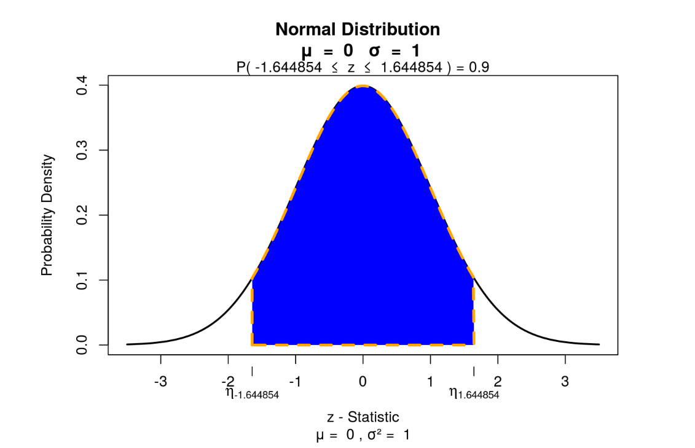
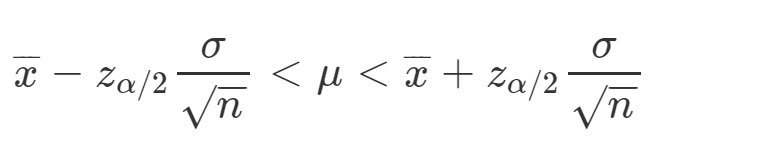
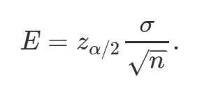
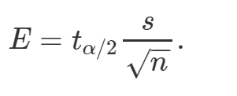
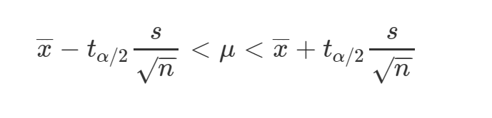

# Guía 5 - Probabilidades. Teoría de la Estimación

## Ejercicio 1

Dos empresas se presentan a una licitación para la entrega de materiales para una construcción. Para decidir la adjudicación, se analiza el plazo de entrega de los materiales que cada empresa propone. Se sabe que ese plazo es una variable aleatoria que tiene distribución normal, con los siguientes parámetros:

* Empresa A: número esperado de días de entrega (media) = 8; sd=3.
* Empresa B: número esperado de días de entrega (media) = 9; sd=2.

* ¿A cuál de las empresas debiera adjudicarse la licitación, tomando en cuenta los datos precedentes, sabiendo que se le exigirá que las entregas se realicen, en un plazo máximo de 14 días?

## Ejercicio 2

El sector de control de calidad de una fábrica que produce dardos registró los diámetros de una muestra de tamaño n=10, resultado en los siguientes. El promedio de los diámetros fue igual a 3 milímetros y el desvío estándar sd=0.5. 

* ¿Cuál es la probabilidad de obtener un diámetro inferior a 2.5 mm?
Nota: recuerde que la distribución normal se utiliza para muestras n>30.

### En R

```{r eval=FALSE}
En primer lugar calculo t
t<-(2.5-3)/(0.5/sqrt(10))
t
```

Luego, reemplazo ese valor en el siguiente comando:

```{r eval=FALSE}
pt(q=t, df=grados-libertad, lower.tail=T)
```

Recuerde: Grados de libertad (GL) = n-1

### Cálculo de intervalos de confianza para la media de una población con desviación típica conocida

Supongamos que queremos calcular un intervalo de confianza para una media poblacional sabiendo que la media muestral es de 32 y la desviación típica poblacional de 6. La muestra es de 50 individuos.

Los pasos para calcular los intervalos de confianza son:

1. Lo primero es fijar un nivel de confianza 1-alfa (siendo alfa la máxima probabilidad aceptada de cometer un error). 

La probabilidad de que nuestra estimación esté dentro de ciertos valores es fijada de antemano. Normalmente los valores de confianza son del 90%, 95% o 99%. 


_Para este ejercicio fijamos un nivel de confianza del 90%_

2. Cálculo del valor de Z

Siendo z(alfa/2) , el cuantil de la distribución normal estándar que arrastra una probabilidad de alfa/2, con alfa nivel de significancia establecido.

si yo deseo tener un nivel de confianza del 90%, entonces alfa va a ser del 10% y alfa/2 va a ser 5%.

```{r  out.width = "100%", echo=FALSE}
library(knitr)
 
```


```{r}
qnorm(0.05,0,1) #el valor de alfa/2=0.05, media=0 y sd=1
```

3.Cálculo de los límites del intervalo. 

Está dado por la siguiente fórmula


```{r  out.width = "50%", echo=FALSE}
library(knitr)
 
```


Resolvemos
```{r}
n <- 50    # El tamaño válido de la muestra
media <- 32 # la media 
desv <- 6  # La desviación estándar. Datos históricos
nivelconfianza = 0.90
```


utilizo la formula

```{r  out.width = "50%", echo=FALSE}
library(knitr)
 
```

```{r}
error.est <- desv/sqrt(n) # Calculamos el error estándar
margen.error <- 1.644854 * error.est # nivel de confianza de 90% 
```


```{r}
lim.inf <- media - margen.error # Límite inferior del intervalo
lim.inf
```

```{r}
lim.sup <- media + margen.error # Límite superior del intervalo
lim.sup
```


### Cálculo de intervalos de confianza para la media de una población para muestras pequeñas o desviación típica desconocida

Cuando no conocemos la desviación típica de la población o la muestra es pequeña (n<30), no podemos estimar el error estándar con el desvío típico debido a que no se cumple el teorema central del límite. En estas ocasiones usaremos una nueva distribución de probabilidad llamada t de student.
Algunas características de la distribución t de student son:

a. Está centra en cero (al igual que Z).
b. Es simétrica.
c. Es menor en la media y mas alta en los extremos que una distribución normal.
Tiene proporcionalmente mayor parte de su área en los extremos que la distribución normal.
Existe una distribución t para cada tamaño de la muestra, por lo que “Existe una distribución para cada uno de los grados de libertad” Los grados de libertad se calculan con la siguiente fórmula:
GL=n – 1

Al igual que para el resto de las distribuciones, podemos calcular la función densidad, acumulada y quantil de la distribución t de student a través de R con las siguientes fórmulas:


* dt(x, df) para la función densidad
* pt(q, df) para la función acumulada
* qt(p, df) para calcular los cuantiles

_Cálculo del margen del error para para muestras pequeñas o desviación típica desconocida_


Utilizamos la siguiente fórmula

```{r  out.width = "50%", echo=FALSE}
library(knitr)
 
```


t(alfa/2) lo calculamos con la función qt(probabilidad, grados de libertad)

Por ejemplo para un nivel de confianza de 0.9, alfa/2 va a ser 0.05 y una muestra de tamaño 10


```{r}
qt(0.05,9)
```


t(alfa/2)=1.833

Para armar el intervalo de confianza usamos la siguiente fórmula:


```{r  out.width = "50%", echo=FALSE}
library(knitr)
 
```


## Ejercicio 3 

Se ha obtenido una muestra de 15 vendedores de una Editorial para estimar el valor medio de las ventas por trabajador en la Empresa. La media y varianza de la muestra (en miles de euros) son 5 y 2, respectivamente.
a. Determine el intervalo de confianza para la venta media por trabajador en la Editorial al 99 %.

### En R

```{r eval=FALSE}
n <- 15   # El tamaño válido de la muestra
media <- 5 # la media 
nivelconfianza = 0.99
desv <- sqrt(2)  
```


```{r eval=FALSE}
#En vez de _qnorm_ utilizo _qt_ en este caso de muestras pequeñas, 
#estoy trabajando con la distribución t de student
qt(0.005,14) # 0.005 y 14 grados de libertad
```

```{r eval=FALSE}
error.est <- desv/sqrt(n) # Calculamos el error estándar
margen.error <- 2.97 * error.est # nivel de confianza de 99% 
```

Cálculo de límite inferior
```{r eval=FALSE}
lim.inf <- media - margen.error # Límite inferior del intervalo
lim.inf
```

Cálculo el límite superior
```{r eval=FALSE}
lim.sup <- media + margen.error # Límite superior del intervalo
lim.sup
```


## Ejercicio 4

Una muestra de 140 observaciones arrojó un promedio=30 y un desviación típica=6

a. Hallar los límites de confianza del 95% para la media
b. Considere que la muestra fue de 25 observaciones y hallar el intervalo de confianza para media con el 95%.
c. ¿Qué diferencia encuentra entre ambos intervalos? Redacte su interpretación.


