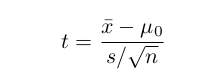
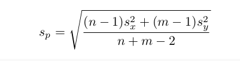
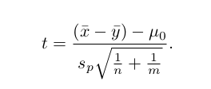

# Guía 6 - Test de hipótesis

## Problema 1

Ante una denuncia de los consumidores a la Dirección de Lealtad Comercial, una empresa quiere saber si puede garantizar que las cajas de un de un detergente en polvo que vende, contiene 500 gramos del producto. Por experiencia, la firma sabe que la cantidad de detergente que contienen las cajas tiene distribución normal, por lo que se toma una muestra aleatoria de 35 cajas y se calcula la media de detergente contenido en ellas, lo que da un valor de 480 gramos, con un desvío estándar de 75 gramos. Con esos datos, pruebe si el contenido no supera los 500 gramos con un nivel de significación del 5 %.

```{r}
#H0: mu=500
#H1: mu<500
```

```{r}
#Ingreso los valores en R
x_media<-480
desvia<-75
n<-35
mu<-500
```

```{r}
z <- (x_media - mu) / (desvia / sqrt(n))
z 
```

```{r}
pnorm(z, 0, 1)
```

```{r}
#lo anterior es lo mismo que
pnorm(z)
```

```{r}
#P-valor=0.057 es mayor que 0.05, entonces acepto H0.
#Esto significa que no hubo evidencia suficiente o significativa para #rechazar H0
```


## Ejercicio 2

Supongamos que una tienda de comestibles vende cajas de cereal Captain Crisp con un peso de 16 onzas. El departamento de control de calidad, requiere asegurarse que la media de las cajas de de cereal pesan al menos 16 onzas. Se tomó una muestra aleatoria de tamaño 9 (cajas) y se pesó. 
Trabaje con un nivel de significancia (alfa) de 0.05


||Pesos||
|-----|-----|-----|-----|-----|
|| 15.5  | 16.2 | 16.1 ||
|| 15.8  | 15.6 | 16.0 ||
|| 15.8  | 15.9 | 16.2 ||

La compañía asegura que la media de las cajas de cereal es **al menos** de 16 onzas. 

a. ¿Cuántas muestras involucra el problema?
```{r}
#El problema incluye 9 muestras.
```


b. Plantee las hipótesis y realice el test. Trabaje con valor de significancia del alfa=0.05

```{r}
#H0: mu=16
#H1: mu>16
```


### En R

En primer lugar, ingreso los datos

```{r}
caja_cereal<-c(15.5, 16.2, 16.1, 15.8, 15.6, 16.0, 15.8, 15.9, 16.2)
```

En R, podemos hacerlo paso a paso de la siguiente manera:

1. Realizo cálculos de media y desviación típica

```{r }
x_bar<-mean(caja_cereal)
s<-sd(caja_cereal)
mu_0<-16
n=9
```

2. Cálculo de t de prueba

```{r  out.width = "40%", echo=FALSE}
library(knitr)
 
```


```{r }
t<-(x_bar-mu_0)/(s/sqrt(n))
t
```

3. p-valor
```{r }
1-pt(t, df = 8)
```

La otra forma es hacerlo con la funcion t.test, ingresando los valores apropiados:
```{r }
t.test(x = caja_cereal , mu = 16, alternative = c("greater"), conf.level = 0.95)
```

c. Concluir sobre los resultados obtenidos. 

```{r}
#Conclusión 
#p-value = 0.8678 > 0.05  <------ PVALOR > ALFA
#ACEPTO LA HIPOTESIS NULA 
```


## Ejercicio 3

### Prueba t de muestras independientes
Se tienen 2 set de datos que corresponden a pesos de hombres y mujeres de dos muestras independientes. Queremos saber si existen diferencias significativos entre los dos grupos de estudio. 

|| Muestra | Hombres | Mujeres ||
|:---:|:---:|:---:|:---:|-------|-----|
|| 1 | 70 | 64 ||
|| 2 | 82 | 72 ||
|| 3 | 78 | 60 ||
|| 4 | 74 | 76 ||
|| 5 | 94 | 72 ||
|| 6 | 82 | 80 ||
|| 7 | -  | 84 ||
|| 8 | -  | 68 ||


a. ¿Cuántas muestras involucra el problema?

```{r}
#Se tienen en total 2 muestras
```

b. Plantee las hipótesis del experimento y el estadístico de prueba.
```{r}
#H0: mu=0
#H1: mu distinto a 0
```

c. Realice la prueba de hipótesis con un intervalo de 95% de confianza. 

### En R

1. Ingreso de datos y cálculo de n y m
```{r }
varones = c(70, 82, 78, 74, 94, 82)
n = length(varones)
n
mujeres = c(64, 72, 60, 76, 72, 80, 84, 68)
m = length(mujeres)
m
```

2. Cálculo de media y desviación típica
```{r }
x_bar<-mean(varones)
x_bar
s_x<-sd(varones)
s_x
y_bar<-mean(mujeres)
y_bar
s_y<-sd(mujeres)
s_y
```

3. Cálculo de la desviación estándar agrupada
```{r  out.width = "60%", echo=FALSE}
library(knitr)
 
```

```{r }
s_p = sqrt(((n - 1) * s_x ^ 2 + (m - 1) * s_y ^ 2) / (n + m - 2))
s_p
```

4. Cálculo de t 

```{r  out.width = "40%", echo=FALSE}
library(knitr)
 
```


```{r }
t = ((x_bar - y_bar) - 0) / (s_p * sqrt(1 / n + 1 / m))
t
```

5. Cálculo de p-valor


```{r }
1 - pt(t, df = n + m - 2)
```

O podemos hacerlo mediante la función t.test()
```{r }
t.test(varones, mujeres, mu=0, alternative = c("greater"), var.equal = TRUE)
```


d. ¿Existen diferencias significativas entre ambos grupos?

```{r}
#Conclusión
#alfa=0.05/2 = 0.025
#pvalor=0.04662 > 0.025 ----> ACEPTO la hipótesis nula.
```


## Ejercicio 4

### Prueba t de muestras dependientes o prueba t-apareada


Una escuela de atletismo ha tomado un nuevo instructor, y quiere testear la efectividad del nuevo entrenamiento propuesto comparando las medias de 10 corredores en los 100 metros. Se presentan los tiempos antes y después del entrenamiento de cada atleta. 

||Tiempos||
|-----|-----|-----|-----|-----|----|-----|-----|-----|-----|-----|-----|
|| Antes | 12.9  | 13.5 | 12.8 | 15.6  | 17.2 | 19.2 | 12.6  | 15.3 | 14.1 | 11.3 ||
|| Después | 12.0  | 12.2 | 11.2 | 13.0  | 15.0 | 15.8 | 12.2  | 13.4 | 12.9 | 11.0 ||


a. ¿Cuántas muestras involucra el problema?

```{r}
#El problema involucra 2   muestras.
```

b. ¿Cómo plantearía las hipótesis y cuál es el estadístico de prueba?
```{r}
#H0: mu=0
#H1: mu>0
```

c. Realizar una prueba de hipótesis con un 95% de confianza.

### En R

```{r}
#Ingreso los datos
a<-c(12.9, 13.5, 12.8, 15.6, 17.2, 19.2, 12.6, 15.3, 14.4, 11.3)
b<-c(12.0, 12.2, 11.2, 13.0, 15.0, 15.8, 12.2, 13.4, 12.9, 11.0)
```


```{r }
#Cálculo la diferencia y la media de esas diferencias con la función mean()
diferencia<-a-b
diferencia
mean(diferencia)
```

```{r }
#Cálculo de t
t<-mean(diferencia)/(sd(diferencia)/sqrt(10))
t
```

```{r }
#Cálculo del p-valor
1- pt(t, df = 10 - 1)
```


```{r }
t.test(a, b, mu=0, alternative="greater", paired=TRUE, var.equal=T)
```

 
```{r}
#Conclusión
#p-value=0.0002579 < 0.05 ----> RECHAZO LA HIPOTESIS NULA
```


## Ejercicio 5


Una empresa necesita comprar engranajes plásticos para un tipo impresora láser; en la ciudad donde existen dos proveedores que fabrican este tipo de engranajes. Para decidir a cuáles de los proveedores comprarle, la empresa analiza una característica importante de los mismos que es la resistencia al impacto de esos engranajes (medida en pies/libra). Para ello, tomó una muestra aleatoria de engranajes de cada proveedor.


||Proveedor| n | Media | Desviación estándar ||
|:---:|:---:|:---:|:---:|:---:|--------|-------|
|| 1 | 10 | 290 | 12||
|| 2 | 16 | 321 | 22||

Se desea estudiar si existe evidencia para apoyar la afirmación de que el proveedor 2 ofrece engranajes con mayor resistencia al impacto medio que el proveedor 1.

a. ---
b.  Defina las hipótesis en este problema y escriba la expresión del estadístico de prueba.
c.  Verifique las hipótesis planteadas en b) utilizando alfa = 0.05. ¿Qué conclusión obtiene?

```{r}
# H0: mu=0
# H1: mu1<mu2----> mu1-mu2<0
```

```{r}
#Se desea estudiar si existe evidencia para apoyar la afirmación 
#de que el proveedor 2 ofrece engranajes con
#mayor resistencia al impacto medio que el proveedor 1.
```

```{r}
# Prueba t para muestras independientes
# n<30 utilizamos prueba t 
x_bar<-290
y_bar<-321
s_x<-12
s_y<-22
n<-10
m<-16
```

```{r}
s_p = sqrt(((n - 1) * s_x ^ 2 + (m - 1) * s_y ^ 2) / (n + m - 2))
s_p
```

```{r}
t = ((x_bar - y_bar) - 0) / (s_p * sqrt(1 / n + 1 / m))
t
```

```{r}
pt(t, df=n + m - 2)
```

```{r}
#Conclusión
#alfa=0.05/2--->0.025
#pvalue=0.0002190867 < 0.025 ----> pvalue < alfa
#RECHAZO LA HIPOTESIS NULA
```


## Ejercicio 6
Una empresa de software está investigando la posibilidad de cambiar el lenguaje de programación usado comúnmente, de forma de sustituir el lenguaje C (Leng C) por Visual Basic (VBA), a fin de mejorar la rapidez de programación y aumentar así la productividad de la empresa. Para ello se pide a 12 programadores, todos familiarizados con ambos lenguajes, que programen un cierto algoritmo en ambos lenguajes. Se registró el tiempo que tardan en completar la tarea en cada caso, produciendo los siguientes datos medidos en minutos:


||Programador||
|:---:|:---:|:---:|:---:|:---:|:---:|:---:|:---:|:---:|:---:|:---:|:---:|:---:|:---:|
|| Lenguaje | 1 | 2  | 3 | 4 | 5  | 6 |  7  | 8  | 9  | 10 | 11  | 12 ||
|| VBA | 17 | 16 | 21 | 14 | 18  | 24 |  16  | 14  | 21  | 23 | 13  | 18 ||
|| Leng C | 18 | 14  | 19 | 11 | 23  | 21 |  10  | 13  | 19  | 24 | 15  | 20 ||
    
1.	Enuncie formalmente las hipótesis que le interesa testear a la empresa de software y calcule el estadístico de prueba.
2.	A partir de los dos puntos anteriores, ¿Qué lenguaje erigiría si usted fuese el dueño de la empresa?


```{r}
# H0 mu=0
# H1 mu mayor a 0
```

  ```{r}
#La diferencia de medias debería ser mayor a 0. Esto quiere decir que el tiempo disminuyó. 
#La diferencia entre VBA y lenguaje C debería ser positiva, 
#lo que quiere decir que en valor absoluto VBA es mayor que lenguaje C.
#En otras palabras, se tarda mas tiempo en programar VBA que en lenguaje C.
```


```{r}
vba<-c(17,16,21,14,18,24,16,14,21,23,13,18)  
lenguajec<-c(18,14,19,11,23,21,10,13,19,24,15,20)
```

```{r}
#Cálculo la diferencia y la media de esas diferencias con la función mean()
diferencia<-vba-lenguajec
diferencia
mean(diferencia)
```


```{r }
#Cálculo de t
t<-mean(diferencia)/(sd(diferencia)/sqrt(12))
t
```

```{r}
1- pt(t, df = 12 - 1)
```


```{r}
#todo lo anterior se puede calcular de 1 solo paso en este comando
t.test(vba, lenguajec, paired=TRUE, mu=0, alternative="greater")
```

```{r}
#Conclusión
#p-value=0.2262 > 0.05 ----> acepto 
#ACEPTO la hipótesis nula 
```

