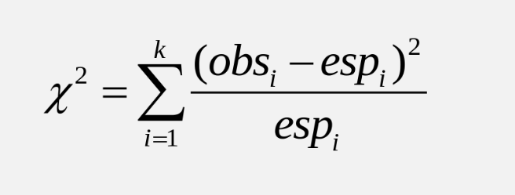

# Guía 7 - Pruebas de Chi-Cuadrado

## Ejercicio 1

Una máquina mezcla cacahuetes, avellanas, anacardos y nueces a razón de 5/10, 2/10, 2/10 y 1/10 respectivamente. El area de mantenimiento quiere asegurarse que la máquina funciona bien, para lo cual se seleccionó una lata de 500 de estos frutos secos la cual contiene 269 cacahuetes, 112 avellanas, 74 anacardos y 45 nueces de Brasil. Al nivel de significación del 10 %, pruebe la hipótesis de que la máquina mezcla los frutos secos en la razón 5:2:2:1, es decir que funciona bien.

## Ejercicio 2


En un estudio acerca de los hábitos con que observan televisión los niños, un grupo de investigadores eligen una muestra aleatoria de 300 niños (100 niños y 200 niñas) de 6 años. A cada niño se le pregunta cuál de los siguientes tres programas de televisión les gusta mas: El llanero solitario, Plaza Sésamo o Los Simpsons. Los resultados se muestran en la siguiente tabla de contingencia. 


||Preferencias||
|-----|-----|-----|-----|-----|-----|
|| ---  | El llanero solitario | Plaza Sésamo  | Los Simpsons  | Totales ||
|| Niños  | 50 | 30 | 20 | 100 ||
|| Niñas  | 50 | 80 | 70 | 200 ||
|| Totales  | 100 | 110 | 90 | 300||


¿Las preferencias de los niños varones para estos programas difiere significativamente de las preferencias de la niñas? Utilize un 0.05 nivel de significancia. 

```{r eval=FALSE}
#Vamos a calcular los grados de libertad
columnas<-3
filas<-2
DF<-(columnas-1)*(filas-1)=(3-1)*(2-1)
```

  
```{r}
# Vamos a calcular los valores esperados
E11 <- (100 * 100) / 300 
E12 <- (100 * 110) / 300 
E13 <- (100 * 90) / 300 
E21 <- (200 * 100) / 300 
E22 <-(200 * 110) / 300 
E23 <- (200 * 90) / 300 
```

```{r}
#Los valores observados son los que aparecen en la tabla
O11<-50 #niños
O12<-30
O13<-20
O21<-50 #niñas
O22<-80
O23<-70
```

```{r }
#Vamos a calcular X cuadrado
#reemplazamos en la fórmula dada en teoría
```

```{r out.width = "40%", echo=FALSE}
library(knitr)
 
```


```{r}
#En R
  Xcuadrado<-(O11-E11)^2/E11 + (O12-E12)^2/E12 + (O13-E13)^2/E13 + 
    (O21-E21)^2/E21 +  (O22-E22)^2/E22 + (O23-E23)^2/E23

```

```{r eval=FALSE}
#Ahora busco el p-valor reemplazando en primer lugar el valor de X cuadrado
#X_2 valor de chi cuadrado obtenido
#df=grados de libertad
pchisq(Xcuadrado, df=2)
```

  

## Ejercicio 3

Se realiza un estudio entre estudiantes que tiene en cuenta a fumadores y cuanto ejercicio físico realizan. 

* Los fumadores pueden ser Heavy=fumador excesivo, Never=nunca, Ocass=ocasional y Regul=regular. 

* La cantidad de ejercicio físico que realizan es Freq=frecuente, None=ninguno, Some=algo. 
Se observan los datos en la siguiente **tabla de contingencia**. 

```{r}
library(MASS)
tbl <- table(survey$Smoke, survey$Exer)
tbl
```

Haga la prueba de hipótesis si el hábito de fumar de los estudiantes es independiente del ejercicio que realizan en un 0.05 y concluya. 

```{r eval=FALSE}
chisq.test(tbl)
```


## Ejercicio 4

Vamos a trabajar con el set de datos mtcars con el cual habíamos trabajado previamente. 
Los datos fueron extraido de la revista Motor Trend US de 1974 y muestran el consumo de combustible y 10 aspectos del diseño de automóviles en 32 modelos diferentes. Para una explicación más detallada de las variables en estudio en este set de datos, puede visitar
          
http://rstudio-pubs-static.s3.amazonaws.com/61800_faea93548c6b49cc91cd0c5ef5059894.html 

```{r}
# Recordemos que para buscar más información en R
?mtcars
```

Vamos a agrupar de a 2 variables y formar distintas tablas de contingencia

Tabla 1: Variables vs y am. Corresponde a vs=tipo de motor (0=V-shaped, y 1=straight) y am=transmisión (0 = automática, 1 = manual)
```{r}
attach(mtcars)
vsAm <- table(vs, am)  
vsAm
```


Tabla 2: Variables gear y carb. Corresponde a carb=número de carburadores y gear=número de marchas adelante. 

```{r }
Gearcarb<- table(gear, carb)  
Gearcarb
```


Tabla 3: Variables cyl y gear. Corresponde a cyl= número de cilindros y gear=número de marchas adelante 

```{r}
cylGear <- table(cyl,gear)
cylGear
```

En los 3 casos aplique pruebas de chi cuadrado, y analizando sobre los p-valor. ¿Qué puede concluir? Redacte al menos 5 oraciones. 

* Prueba 1 
```{r eval=FALSE}
chisq.test(vsAm) 
```

* Prueba 2
```{r eval=FALSE}
chisq.test(Gearcarb) 
```

* Prueba 3
```{r eval=FALSE}
chisq.test(cylGear) 
```

